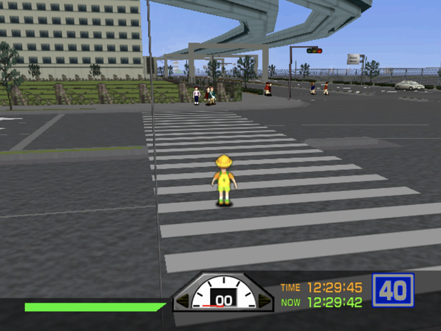
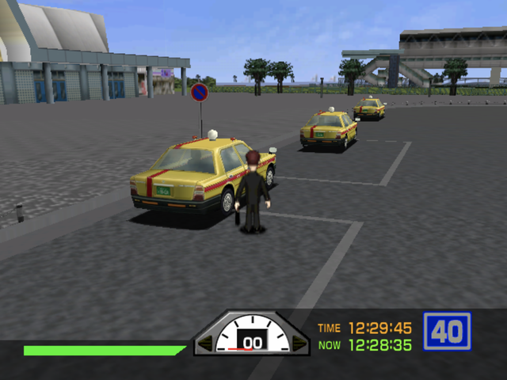
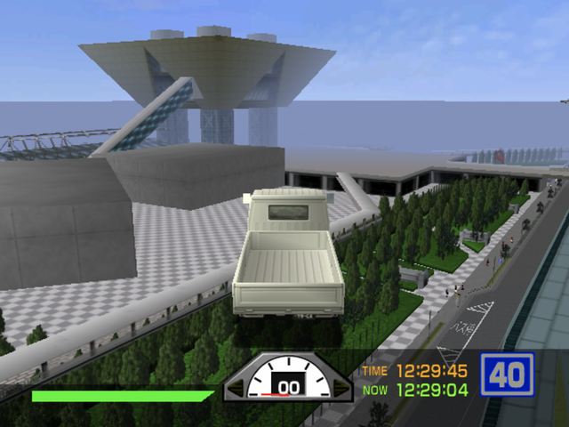

# Tokyo Bus Guide (Japan): Tokyo BS Guide

A sandbox mod for the Dreamcast game *Tokyo Bus Guide* (東京バス案内, Fortyfive, 1999): get off
the bus and walk as one of the game's own pedestrians, take any traffic car or parked taxi, and
drive around Tokyo with the route rules switched off.

  

## Download

**Latest release:** [Tokyo BS Guide v1.0](https://github.com/consolesplayingconsoles/game-mods/releases/tag/tokyo-bus-guide-japan-tokyo-bs-guide-v1.0)

Two builds, same mod:

* [`Tokyo Bus Guide (Japan) [Tokyo BS Guide by cpc v1.0].dcp`](https://github.com/consolesplayingconsoles/game-mods/releases/download/tokyo-bus-guide-japan-tokyo-bs-guide-v1.0/Tokyo.Bus.Guide.Japan.Tokyo.BS.Guide.by.cpc.v1.0.dcp) — with the English translation.
* [`Tokyo Bus Guide (Japan) [Tokyo BS Guide JP by cpc v1.0].dcp`](https://github.com/consolesplayingconsoles/game-mods/releases/download/tokyo-bus-guide-japan-tokyo-bs-guide-v1.0/Tokyo.Bus.Guide.Japan.Tokyo.BS.Guide.JP.by.cpc.v1.0.dcp) — with the game's Japanese text.

Releases in this monorepo are namespaced per game, so the tag carries the game name
(`tokyo-bus-guide-japan-...`), not just a version.

## What it does

* Step off the bus at the door: you become one of the game's own pedestrian sprites and the
  camera follows you. The bus stays where you left it.
* Take any traffic car or parked taxi. The traffic AI gives up the one you steal.
* Horn (each model gets one of the game's six traffic horns), radio through the game's own bgm
  tracks, handbrake, turbo burst, and a ghost mode that lets a car fly.
* Penalties never lower the score, and are off entirely while you are out of the bus. That is
  the key to the whole thing: the levels turn out to be small and pleasant once traffic
  penalties stop throwing you out of them.

## Controls

| Button | On foot | In a car |
|---|---|---|
| Stick | walk (camera relative) | steer / height in ghost mode |
| R | sprint | accelerate |
| L | — | brake, then reverse |
| A | jump | horn |
| B | — | handbrake |
| X | — | radio, next track |
| Y | — | turbo burst |
| D-pad Up | — | ghost mode on/off |
| D-pad Down | next pedestrian look | — |
| D-pad Right | enter/exit vehicle | enter/exit vehicle |

On the bus everything is the original game, plus D-pad Right to get off.

## Applying the patch

Use [Universal Dreamcast Patcher](https://github.com/DerekPascarella/UniversalDreamcastPatcher).
It rebuilds a disc image from your own copy of the game, so GDI, CUE+BIN and CHD all work, and
it can output a GDI for a GDEMU.

You need **Tokyo Bus Guide (Japan), V1.003** (the 1999-11-24 pressing). The later **Rev A
(V2.000)** is a different disc and the patch does not apply to it.

```
Tokyo Bus Guide (Japan).gdi   CRC32 468C1495   MD5 346FEA58AB1A55C577138C5B04319157
track01.bin                   CRC32 CA1BA208   MD5 7B2D900981E0B7B87EBF9312FD206098
track02.raw                   CRC32 2FFBCC4C   MD5 9078A058A0CEBD448243935A693B4D0E
track03.bin                   CRC32 38FC999F   MD5 5FA322A0642CA5352EF733842148AFE7
```

1. Open the **Apply Patch** tab.
2. Select your source disc image.
3. Choose the `.dcp` file.
4. Pick an output folder and format (GDI if you are going to a GDEMU).
5. Apply.

Runs on a real Dreamcast (tested through a GDEMU) and in Flycast.

## Known gaps

* **No building collision.** The game has none: the route grids are the route, not the world.
  The player, the cars and the bus collide with each other as boxes; buildings are scenery you
  walk and drive through.
* **Flat ground on foot.** Your height stays where you got off, so ramps and bridges do not lift
  you.
* **AI cars pass through each other.** Only the car you drive collides.
* **Off-route scenery is thin.** Once penalties are gone you notice how little was built away
  from the route: a flat sea, placeholder ground, a few trees. It only ever had to look right
  from the bus.

## How it was made

Built by rebuilding the game from
[lhsazevedo's Tokyo Bus Guide decompilation](https://github.com/lhsazevedo/tokyo-bus-guide-decomp),
the first public decompilation of a Dreamcast game, rather than patching bytes. Source, build
scripts and the mod's tunables (speeds, box sizes, sprint) live in
[dreamcast-homebrew](https://github.com/consolesplayingconsoles/dreamcast-homebrew/tree/main/mods/tokyo-bus-guide).

## Feedback

Found a bug or have an idea for what the sandbox should do next?
[Open an issue](https://github.com/consolesplayingconsoles/game-mods/issues/new).
