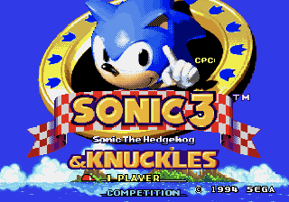
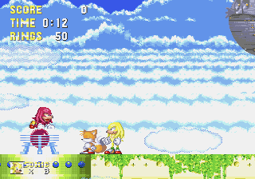
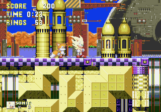
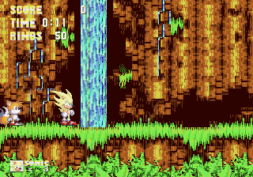

# Sonic & Knuckles + Sonic 3 (World): Sonic 3 Hyper Swap

A mod for *Sonic 3 & Knuckles* on the Mega Drive: press **C** to swap between **Sonic and Knuckles mid-level**, even mid-air. Super form is free and stays on until you drop it.

   

## Download

**Latest release:** [Sonic_and_Knuckles_Sonic_3_World_Hyper_Swap_v1.0](https://github.com/consolesplayingconsoles/game-mods/releases/tag/sonic-and-knuckles-sonic-3-world-hyper-swap-v1.0)

Patch file: [`Sonic_and_Knuckles_Sonic_3_World_Hyper_Swap_v1.0.bps`](https://github.com/consolesplayingconsoles/game-mods/releases/download/sonic-and-knuckles-sonic-3-world-hyper-swap-v1.0/Sonic_and_Knuckles_Sonic_3_World_Hyper_Swap_v1.0.bps)

Releases in this monorepo are namespaced per game, so the tag carries the game name (`sonic-and-knuckles-sonic-3-world-...`), not just a version.

## Applying the patch

The patch is a **BPS**. It rebuilds the modded ROM from your own copy of the game, and BPS verifies your ROM automatically, so a wrong file is rejected rather than silently mispatched.

Easiest, in your browser (no install): [rom-patcher-js](https://www.marcrobledo.com/RomPatcher.js/). Desktop alternative: [Floating IPS (Flips)](https://www.romhacking.net/utilities/1040/).

You will need the **Sonic & Knuckles + Sonic 3 (World)** lock-on ROM (4 MB), the same combined ROM other *Sonic 3 & Knuckles* hacks target:

- CRC32 *63522553*
- MD5 *C5B1C655C19F462ADE0AC4E17A844D10*
- SHA-1 *CFBF98C36C776677290A872547AC47C53D2761D6*

If you only have the two separate carts, the lock-on ROM is simply *Sonic & Knuckles (World)* (CRC32 *0658F691*) followed by *Sonic the Hedgehog 3 (USA)* (CRC32 *9BC192CE*) in one file. You do **not** build or compile anything.

1. Open the patcher.
2. Select your Sonic & Knuckles + Sonic 3 ROM as the source.
3. Choose the `.bps` patch file above.
4. Apply, and save the output ROM.

The output is a single 3.2 MB ROM (CRC32 *0B81FF07*). Load it in a Mega Drive emulator, or flash it to a cart.

## How to play

Start a game as usual (Sonic & Tails, Sonic alone, or Knuckles), then:

| Button | What it does |
|---|---|
| **A** | Jump. |
| **B** | In the air: transform into **Super**. Press again in the air to drop back to normal. |
| **C** | Swap character: Sonic becomes Knuckles, Knuckles becomes Sonic. From Tails, you become Sonic. |
| **Start** | Pause, exactly as in the original. |

- **Super is free.** You start every act with all 7 Chaos Emeralds, and your rings are topped up to 50 whenever you transform. Once Super, you stay Super (no ring drain) until you press B in the air to drop it.
- **No swapping while Super.** Drop Super with B first, then press C.
- **As Knuckles, B transforms instead of gliding.** Glide with A. Gliding while Super drops you back to normal form. This is deliberate.
- **Level select and debug mode are on**, the game's own retail cheats, pre-entered. The title menu gains a Level Select option.

## Known issues

- **Tails is not a swap target.** You can swap away from him, but not into him.
- **The lives icon doesn't change** when you swap.
- **Elemental shield moves are unreachable**, since B transforms first (you always have the emeralds).
- **Cutscenes with Knuckles** (Mushroom Hill act 1, Lava Reef act 2): if you are Knuckles, you'll meet yourself.

## Feedback

Found a bug, or a spot where swapping breaks something? [Open an issue](https://github.com/consolesplayingconsoles/game-mods/issues/new). Note the zone and act, who you were swapping from and to (a screenshot helps), and mention that it is the Sonic 3 Hyper Swap mod.
