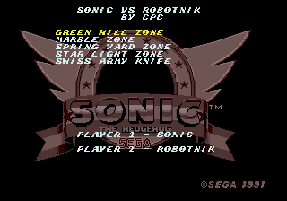
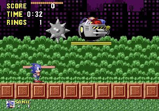

# Sonic the Hedgehog (USA, Europe): Sonic vs Robotnik

A local **2-player fighting mod** for the Mega Drive game *Sonic the Hedgehog*, carved out of its boss fights. Player 1 is Sonic; **Player 2 controls Robotnik** and fights back.

 

## Download

**Latest release:** [Sonic_The_Hedgehog_USA-EU_Sonic_vs_Robotnik_v1.0-Beta](https://github.com/consolesplayingconsoles/game-mods/releases/tag/sonic-the-hedgehog-usa-eu-sonic-vs-robotnik-v1.0-beta)

Patch file: [`Sonic_The_Hedgehog_USA-EU_Sonic_vs_Robotnik_v1.0-Beta.bps`](https://github.com/consolesplayingconsoles/game-mods/releases/download/sonic-the-hedgehog-usa-eu-sonic-vs-robotnik-v1.0-beta/Sonic_The_Hedgehog_USA-EU_Sonic_vs_Robotnik_v1.0-Beta.bps)

Releases in this monorepo are namespaced per game, so the tag carries the game name (`sonic-the-hedgehog-usa-eu-...`), not just a version.

## Applying the patch

The patch is a **BPS**. It rebuilds the modded ROM from your own copy of the game, and BPS verifies your ROM automatically, so a wrong file is rejected rather than silently mispatched.

Easiest, in your browser (no install): [rom-patcher-js](https://www.marcrobledo.com/RomPatcher.js/). Desktop alternative: [Floating IPS (Flips)](https://www.romhacking.net/utilities/1040/).

You will need the original **Sonic the Hedgehog (USA, Europe)** ROM — the standard, widely-available retail dump (No-Intro), the same one romhacking.net hacks target:

- CRC32 *F9394E97*
- MD5 *1BC674BE034E43C96B86487AC69D9293*
- SHA-1 *6DDB7DE1E17E7F6CDB88927BD906352030DAA194*

This is the ordinary Sonic 1 ROM; you do **not** build or compile anything.

1. Open the patcher.
2. Select your Sonic 1 (Rev 1) ROM as the source.
3. Choose the `.bps` patch file above.
4. Apply, and save the output ROM.

Load the output in a Mega Drive emulator, or flash it to a cart — it runs on real hardware.

## How to play

**Two controllers.** Player 1 = Sonic on port 1; **Player 2 = Robotnik on port 2** (Robotnik reads the second pad — it must be on port 2 or he won't move). Boot goes straight to a **duel picker**: D-pad to choose, jump/Start to launch. Each round Sonic has **1 ring / 1 life** — Robotnik wins if Sonic dies, Sonic wins if the boss is beaten, and either result drops back to the picker. Either player can pause with Start.

The duels: **Green Hill** (the wrecking ball), **Marble Zone** (the flamethrower), **Spring Yard** (Robotnik smashes the floor blocks), **Star Light** (the seesaw spike-ball), and **Swiss Army Knife** — a bonus "super" Robotnik with every weapon plus an orbiting spiked ball, over Special Stage music.

## Known issues

This is a **beta**, confirmed running on real Mega Drive hardware but still being balanced from couch sessions. The game is fully playable.

- **Balance is still being tuned**, the Swiss Army Knife duel especially. Feedback from couch matches is very welcome.
- It is deliberately **asymmetric** — the two sides don't play the same, and some duels favour one player. That's part of the fun, but tell me if any duel feels unwinnable.

## Feedback

Found something unfair, a bug, or a duel that plays badly? [Open an issue](https://github.com/consolesplayingconsoles/game-mods/issues/new). Note which duel it happened in (a screenshot helps), and mention that it is the Sonic vs Robotnik mod.
